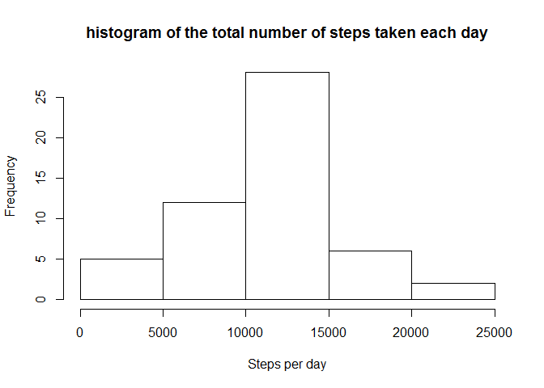
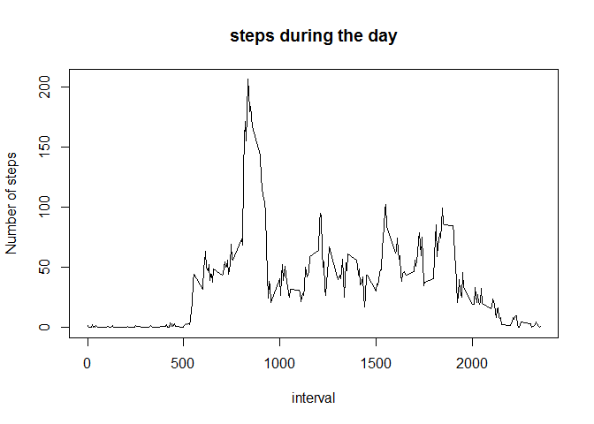
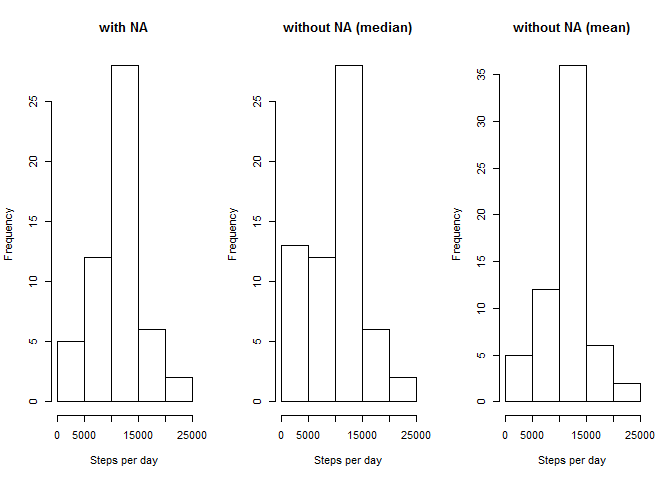
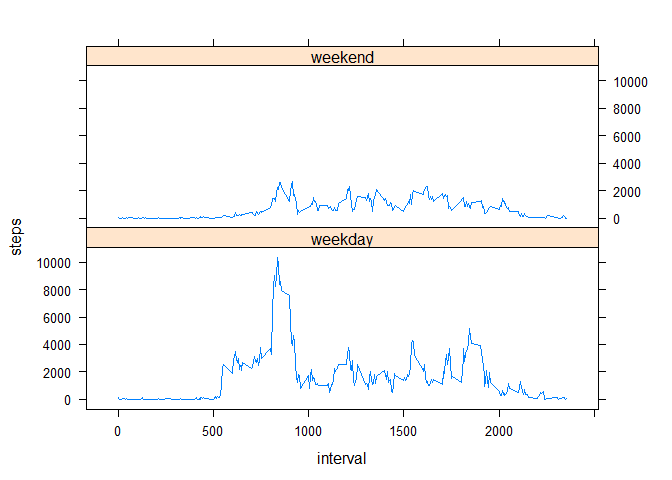

# Reproducible Research: Peer Assessment 1


## Loading and preprocessing the data  

Some useful libraries 

```r
library(dplyr)
```

```
## 
## Attaching package: 'dplyr'
## 
## The following object is masked from 'package:stats':
## 
##     filter
## 
## The following objects are masked from 'package:base':
## 
##     intersect, setdiff, setequal, union
```

```r
library(lattice)
```

File already loaded and now we need only unzip it an read

```r
unzip("activity.zip")
dirty <- read.csv("activity.csv")
```


## What is mean total number of steps taken per day?
We don`t need na values and we need only two columns

```r
 tidy1 <- subset(dirty, is.na(steps) == FALSE, select = c(steps,date))
```

Next, we grouping our data and calculate sum of steps per day

```r
 tidy1 <- summarise_each(group_by(tidy1, date), funs(sum))
```

And create hist

```r
 hist(tidy1$steps, xlab = "Steps per day", main = "histogram of the total number of steps taken each day")
```

 

And finally calculate mean and mediane

```r
print(paste("Mean: ", mean(tidy1$steps)))
```

```
## [1] "Mean:  10766.1886792453"
```

```r
print(paste("Median: ",median(tidy1$steps)))
```

```
## [1] "Median:  10765"
```
## What is the average daily activity pattern?
Prepare data and create plot

```r
tidy2 <- subset(dirty, is.na(steps) == FALSE, select = c(steps,interval))
tidy2 <- summarise_each(group_by(tidy2, interval), funs(mean))
plot(tidy2$interval, tidy2$steps
                   , type = "l"
                   , xlab = "interval"
                   ,ylab = "Number of steps"
                   , main = "steps during the day")
```

 

And finally find interval with maximum average steps

```r
subset(tidy2, tidy2$steps == max(tidy2$steps), select = interval)
```

```
## Source: local data frame [1 x 1]
## 
##   interval
## 1      835
```

## Imputing missing values

ok, now count rows with missing values

```r
nrow(subset(dirty, is.na(dirty) == TRUE))
```

```
## [1] 2304
```

For filling missing values I try to use median and mean by interval because I don`t know what better 

```r
ForNa <- subset(dirty, is.na(steps) == FALSE, select = c(steps,interval))
ForNa <- summarise_each(group_by(ForNa, interval), funs(median))
names(ForNa) <- c("i","med")
tidy3 <- cbind(dirty, ForNa)
tidy3$steps[is.na(tidy3$steps)] <- tidy3$med[is.na(tidy3$steps)]

names(tidy2) <- c("i","med")
tidy4 <- cbind(dirty, tidy2)
tidy4$steps[is.na(tidy4$steps)] <- tidy4$med[is.na(tidy4$steps)]
```

Create 2 new hist and compare it with first

```r
par(mfrow = c(1,3))
 tidy3_g <- summarise_each(group_by(tidy3, date), funs(sum))
 tidy4_g  <- summarise_each(group_by(tidy4, date), funs(sum))

 hist(tidy1$steps, xlab = "Steps per day"
                 , main = "with NA")
 hist(tidy3_g$steps, xlab = "Steps per day"
                 , main = "without NA (median)")
 hist(tidy4_g$steps, xlab = "Steps per day"
                 , main = "without NA (mean)")
```

 

I think that mean is better choise.

imputing missing data take us more results and do our hist more plausible.


## Are there differences in activity patterns between weekdays and weekends?

I create a function for split date to two categories

```r
dateChanger <- function(x){
    if (x == "Вс" | x == "Сб") {"weekend"} else {"weekday"} 
}
```

Then I create new dataset for plotting

```r
q <- weekdays(as.POSIXct(dirty$date), abbreviate = TRUE)
qq <- sapply(q, dateChanger)
tidy5 <- cbind(tidy4, qq)
tidy5  <- summarise_each(group_by(tidy5, interval, qq ), funs(sum))
```

And create very meaning plot

```r
xyplot( steps ~ interval | qq, data = tidy5, type = "l" , layout = c(1,2) )
```

 
